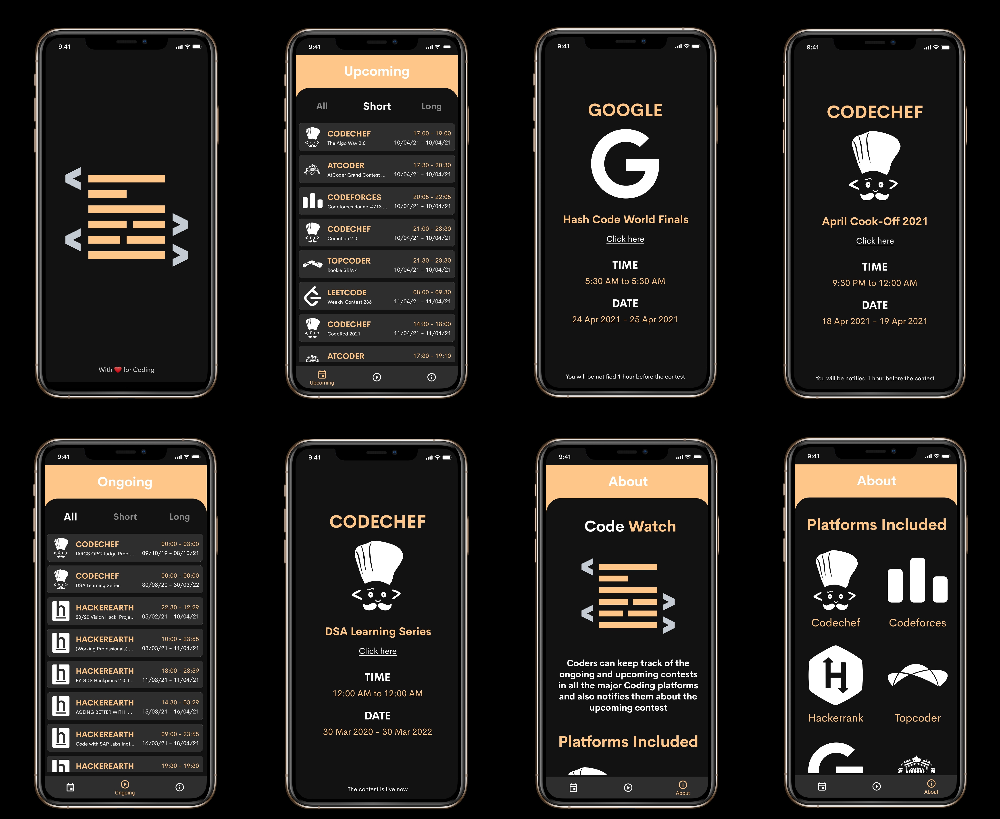

# Code Watch
**Code Watch** is an Android app which helps its users keep track of all the Competitive Programming contests held in various online judges.
The user can see a list of Upcoming and Ongoing contests sorted by date and time. They are further sorted by the length of the contests
such as "Short" and "Long" to further ease the tracking as some users might prefer "Short" over "Long". The main feature of the app is to
send notifications to the user 1 hour before any contest starts.

## Motivation
It is often a tedious task for many coders to keep track of the contests held in various platforms. I often found myself missing contests due
to this reason. Some of my friends faced a similar issue too and hence I built this app.

## Screenshots

## How is the app built?
This app is built natively using Android Studio with Java.

## Features
* See a list of Ongoing and Upcoming contests held in online judges
* The list is sorted by date and time and further by the length of contests
* The contests are filtered as "Short" and "Long" to ease tracking
* Click on a list item to see more details about the contest
* The user gets notified 1 hour before every upcoming contest

## Components/DataStorage used
* **Navigation** - For simplified navigation through fragments
* **Shared Preferences** - For storing information and creating notification

## Other libraries/services used
* **Glide** - For loading images into ImageView
* **Gson** - For converting JSON to POJO and vice versa
* **Lottie** - For loading animations from lottiefiles.com
* **Retrofit** - For making Network calls
* **Clist API** - For getting the data

## Developer and Designer
* **Dinesh B S** [(@DineshBS44)](https://github.com/DineshBS44)

## License
Licensed under MIT License :  https://opensource.org/licenses/MIT

 
 

	Made with :heart: for Coders

